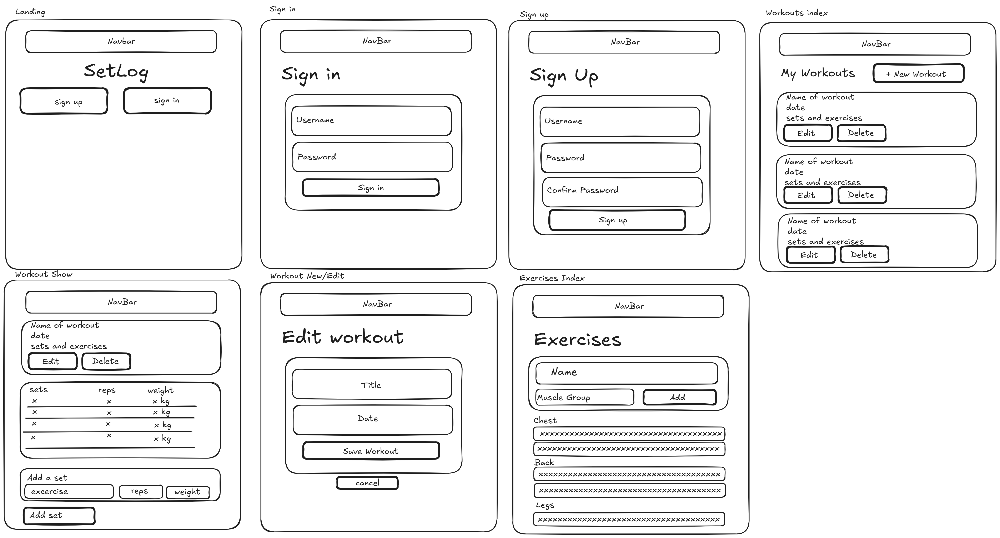

# SetLog

A workout logging app for people who lift. Log a training session, record the exercises you did with the sets, reps and weight for each, and look back at what you lifted last time so you know what to beat.

I built this because I love training, and i always lose track of what i workout and when. so i thought this app could be a good excuse to create something to help me.

## Getting Started

- **Deployed app:** link goes here
- **Planning materials:** [User stories](#user-stories) · [ERD](#erd) · [Wireframes](#wireframes)

## Planning

### User stories

**Auth**

- AAU, I want to sign up for an account so that my workouts are saved to me.
- AAU, I want to sign in and sign out so that my data stays private.
- AAU, I want to be sent to my workouts page when I sign in so I can start logging straight away.

**Workouts**

- AAU, I want to see a list of all my workouts so I can review my training history.
- AAU, I want to create a new workout with a title and date so I can start logging a session.
- AAU, I want to open a single workout to see every set I recorded in it.
- AAU, I want to edit a workout's title or date in case I made a mistake.
- AAU, I want to delete a workout I logged by accident.
- AAU, I want to only see edit and delete controls on workouts I own, so I can't change someone else's data.

**Exercises**

- AAU, I want to see a list of all available exercises so I can pick from them when logging.
- AAU, I want to add a new exercise to the list when the one I did isn't there yet.

**Sets**

- AAU, I want to add a set to a workout by choosing an exercise and entering reps and weight.
- AAU, I want to remove a set from a workout if I logged it wrong.

### ERD

------------------------------------------

**Relationships**

| Relationship        | Cardinality  | Approach   | Why                                                                 |
| ------------------- | ------------ | ---------- | ------------------------------------------------------------------- |
| User → Workout      | one-to-many  | referenced | Workouts grow without limit; a user document shouldn't grow with them |
| Workout → Set       | one-to-many  | embedded   | A set has no meaning outside its workout and is never queried alone   |
| Set → Exercise      | many-to-one  | referenced | "Bench Press" is one shared record; renaming it updates every set     |

### Wireframes

## Technologies Used

- JavaScript (Node.js)
- Express
- MongoDB with Mongoose
- EJS
- express-session with connect-mongo
- bcrypt
- CSS (Flexbox and Grid)

## Attributions

_Fill in if any external assets or libraries needing attribution are used. Remove this section if not._

## Next Steps

- Copy a previous workout as a starting point for today's session
- Personal record tracking per exercise, so the show page flags a new best
- Filter the workouts index by exercise, to see every time I benched
- Charts of volume and top set over time
- Rest timer on the workout show page
